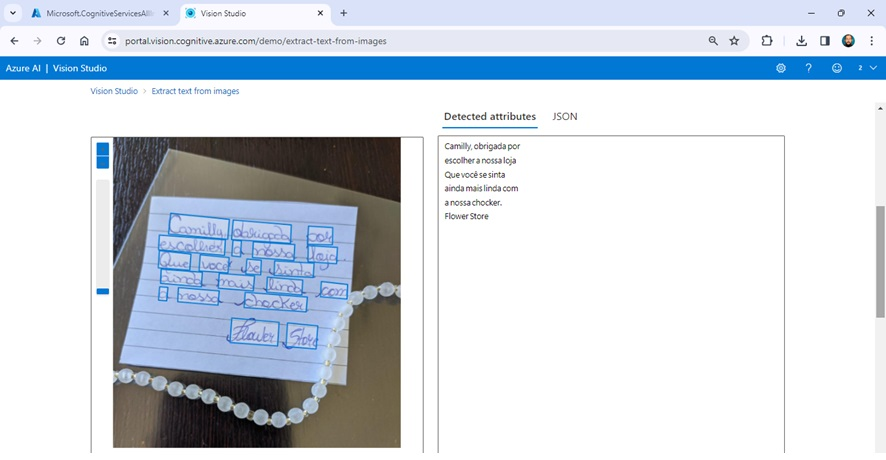
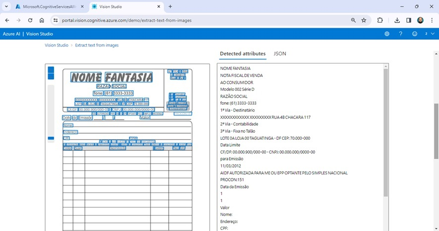

# Reconhecimento Facial e Transformação de Imagens em Dados
O Lab foi direcionado ao conhecimento das ferramentas do Vision Studio.  

Através destas ferramentas, podemos utilzar recursos de Inteligência Artificial para analisar imagens.  

Recursos como reconhecimento facial, descrição de imagens e reconhecimento óptico de caracteres (OCR) foram testados durante as aulas.  

Com esse recursos, temos diversas opções para trabalhar, como por exemplo: acessibilidade e segurança de sistemas.  

Abaixo estão alguns exemplos de reconhecimento óptico de caracteres (OCR):  

Exemplo de OCR em mensagem escrita à mão.

Exemplo de OCR em fontes geradas por computador.
